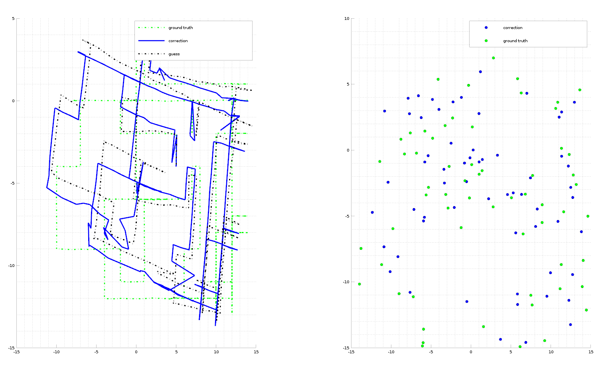
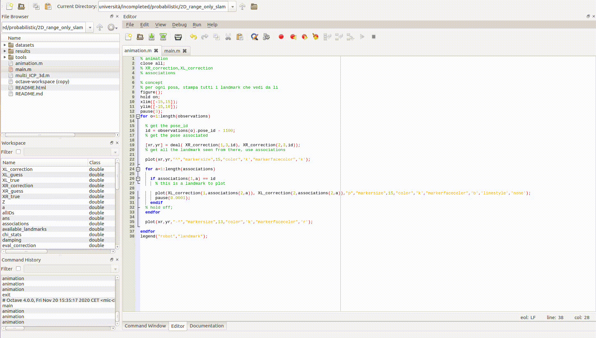

# Perfoming 2D Slam with a Differential Drive Robot having Range Sensor


Project for [Probabilistic Robotics](https://sites.google.com/diag.uniroma1.it/probabilistic-robotics-2019-20), Univ. La Sapienza Roma, 2020.

<a href="https://www.dis.uniroma1.it/"></a>

## Approach
The goal of this project is to optimize the trajectory and the map generated by a unicycle-like robot. The robots moves in the map and it's equipped with a range sensor which can sense the radial distance of landmarks. We know the matching range-landmark_id but the global position of the robot and the global position of the landmark must be corrected using a multipoint ICP.
# The Algorithm follows these phases:
1) First we need to generate an initial guess of the position in world frame of the landmark, so a triangulation procces is launched. This will give a "guess" on the position of the landmarks.
2) Second phase is the ICP algorithm. This is a repetitive optimization algorithm which aims to converge both robot poses and landmark position based on the range measurements.
3) Generation of the resulting plot.

## Project status
Completed <a href="https://github.com/micheleciciolla/vehicles-platooning"></a>

<a href="./results/comparative_results.png"></a>

## Running the test

```bash
octave main.m
```

## Video Demo
Click on the image for complete video
[](https://youtu.be/7jiCi2evqbI) 

## Team
* Michele Ciciolla <a href="https://github.com/micheleciciolla"></a>
<a href="https://www.linkedin.com/in/micheleciciolla/"></a>

## Documentation
No report, sorry.
